# finrecon — an AI finance controller

Three-way reconciliation across merchant orders, a payment gateway and a bank
statement, with a measured accuracy claim, an honest exception queue, a cash
position, and a question-answering agent that is architecturally prevented from
inventing its answers.

**2,222 rows reconciled in 2.0 seconds. 100.00% precision, held at a standard
deviation of 0.00 across 30 datasets the engine had never seen. 333 exception
rows collapsed into 16 investigable findings. Zero wrong matches.**

> Built for Track 04 — *AI Finance Controller: run the books and the cash
> position*. The bar was throughput, measured accuracy and an honest exception
> list, across a 50+ record batch. This runs 2,222 rows, reports its ranges
> rather than its best case, and publishes the seed it did worst on.

---

## Screenshots

<!-- Captured from the running app. To refresh, run the app and replace the files
     in docs/screenshots/ keeping the same filenames. -->


*The Run page — throughput stated against the bar the brief set.*

| | |
|---|---|
| **The queue** — 333 exception rows as 16 findings, sorted by money<br>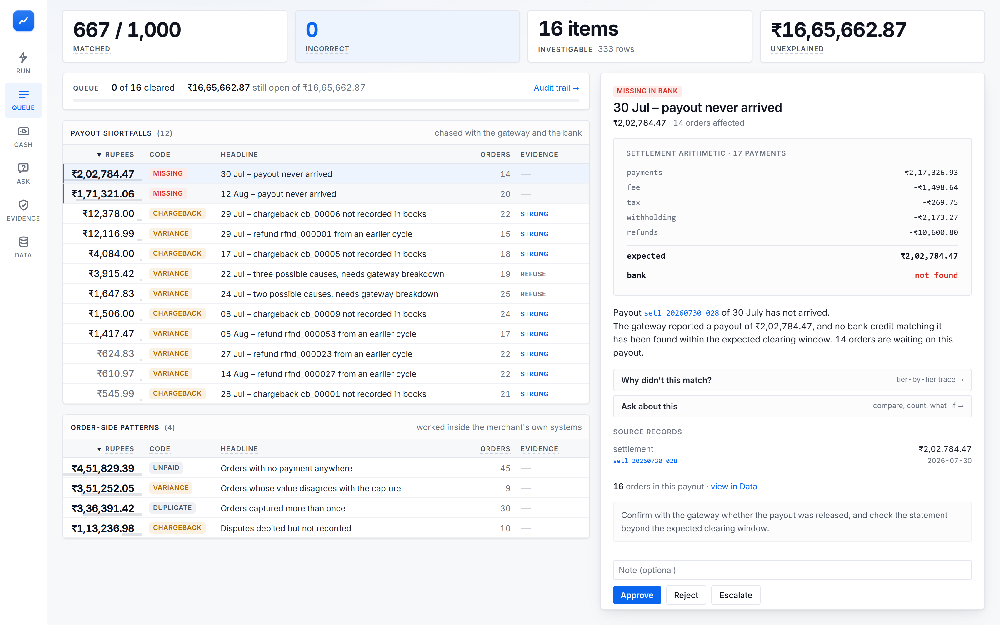 | **The detail pane** — settlement arithmetic, evidence band, source records<br>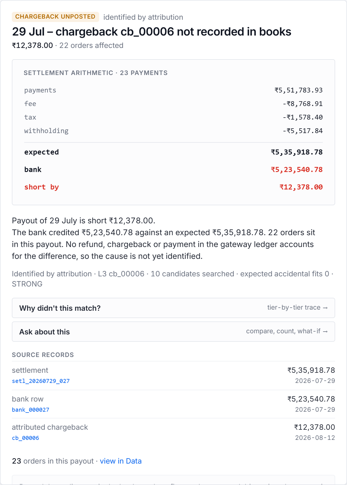 |
| **Cash position** — where every released payout actually is<br>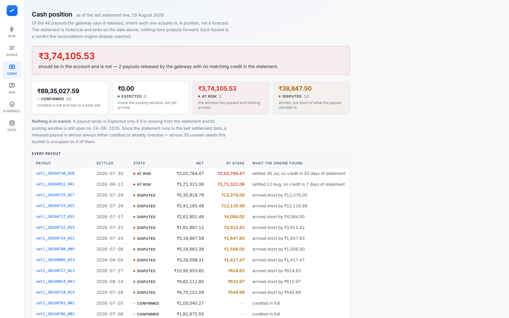 | **Ask** — a live agent with its tool calls and grounding verdict shown<br>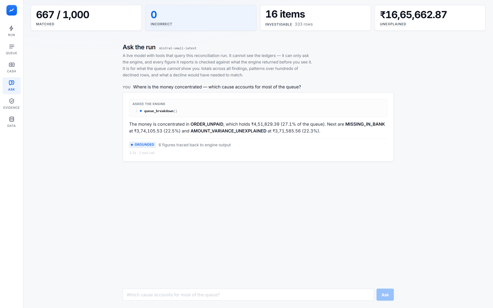 |
| **Evidence** — 30 unseen seeds, tolerance sweep, calibration<br>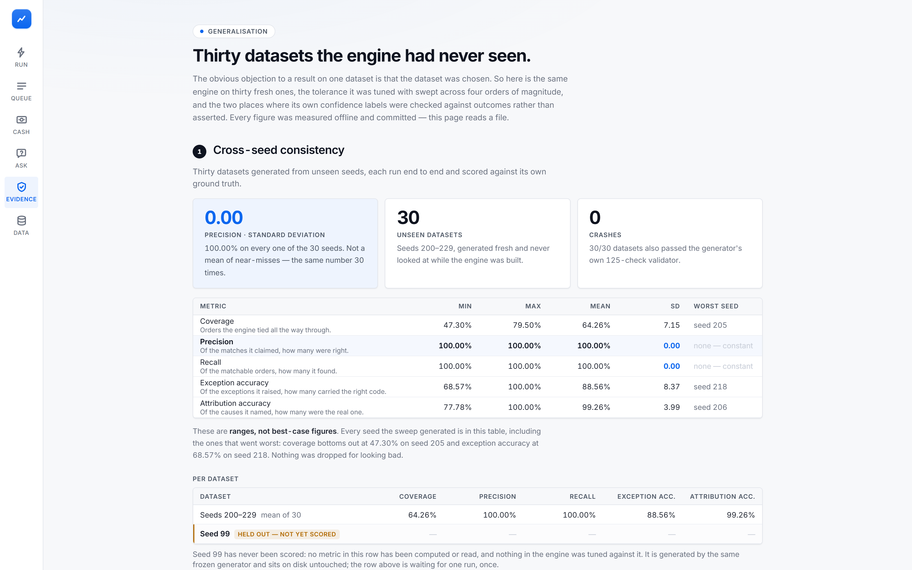 | **Why not?** — the tier-by-tier decline trace for any entity<br>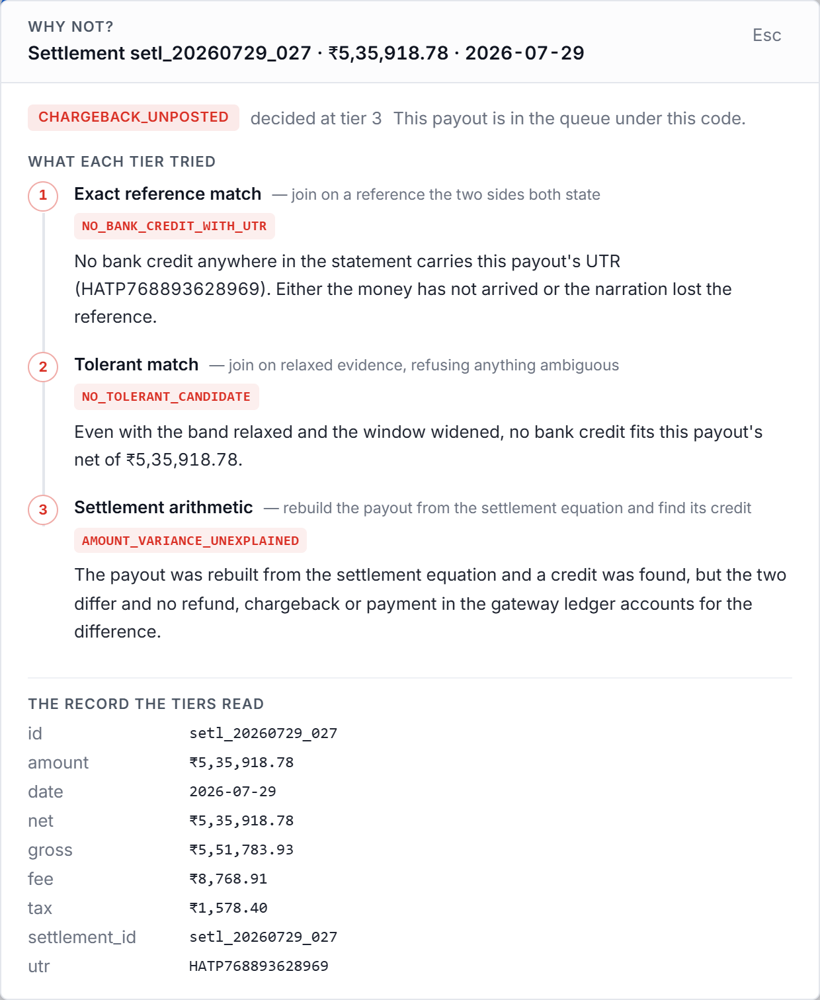 |

---

## Quick start

```bash
pip install -r requirements.txt
python -m uvicorn service.app:app --port 8000     # then open http://127.0.0.1:8000
```

That is the whole thing. The datasets are committed under `data/`, so there is
nothing to generate first.

> **Do not regenerate `data/seed42` or `data/seed99`.** They are frozen. The
> held-out comparison is only meaningful against the bytes that were there when
> the engine was written, and the generator's RNG call order is load-bearing.
> To make a *new* dataset:
> `python scripts/generate.py --seed 123 --orders 1000 --out data/seed123`

The frontend is pre-built and committed to `web/dist`, so `uvicorn` is the whole
deployment — one process, one artifact, no second server, no build step. A judge
opening the URL on a day nobody is watching gets a working app.

`MISTRAL_API_KEY` is optional. Without it, everything works except the Ask page,
which says so plainly.

### Verification

```bash
python tests/test_invariants.py           # data invariants, byte-reproducibility
python eval/validate.py --data data/seed42 # 125 independent checks
python tests/test_firewall.py             # the ground-truth firewall
python tests/test_agent_guardrails.py     # 24 controls, offline, no API key
python tests/test_agent_answers.py        # live agent behaviour (skips without a key)
```

---

## What it does

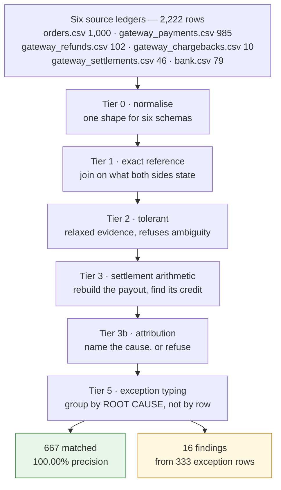

Each tier sees only what the previous one declined, and can add decisions but
never overturn one. That is what makes `tiers=(1,3)` a real before/after
measurement rather than two unrelated runs.

---

## Where the chain actually breaks

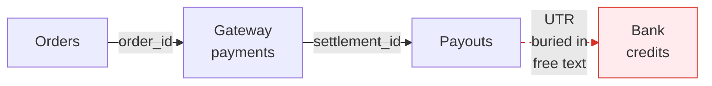

Inside the gateway, every row carries the id of the row before it — those joins
are lookups, not detective work. At the bank they stop. A statement line has a
date, an amount and a narration string, and the only thing tying it to a payout
is a reference buried in that string: sometimes truncated, sometimes absent,
sometimes shared by two rows.

**Everything hard about this problem lives in that last hop.**

| Source of difficulty | Why IDs don't solve it |
|---|---|
| Net settlement | 20+ payments collapse into one bank credit, minus fees, tax, refunds, disputes, withholding. One bank line ≠ one order. |
| Period attribution | A refund on 25 Jul against a 12 Jul capture is deducted from the *25 Jul* cycle. The ID says what was reversed, not which batch absorbed it. |
| Bank boundary | `bank.csv` has a date, free-text narration, a possibly-clipped UTR, and a net amount. No payment ID. No composition. |
| Direct NEFT | Customer bypassed the gateway. No payment object was ever created, so there is no ID to trace. |
| Duplicates | `GROUP BY order_id` *finds* them instantly. Deciding which capture is the real sale is the work. |
| Ambient noise | Salary, vendor and tax rows must be ignored **without** being flagged. |
| Reversal asymmetry | A refund and a chargeback move money identically through the settlement equation. But a refund is a deduction the merchant *initiated* and has booked; a chargeback is one an issuer *imposed*, typically not yet recorded. The arithmetic is symmetric; the books are not. |

The settlement equation is deliberately simple, because net settlement genuinely
is additive:

```
net = gross − fee − tax_on_fee − refunds − chargebacks − withholding
      − carry_forward_in + carry_forward_out
```

The engineering is running it **backwards**: given a bank credit and a variance,
infer which combination of terms explains the gap. That is attribution under
uncertain batch membership, not arithmetic.

---

## The numbers

### This run — seed 42

| | |
|---|---|
| Rows in | **2,222** (orders, payments, refunds, chargebacks, payouts, bank) |
| Wall clock | **2.0s** end to end, single process |
| Throughput | **~1,100 rows/sec**, single-threaded, no index, no database |
| Coverage | 66.70% — 667 of 1,000 orders tied all the way through |
| **Precision** | **100.00%** — 667/667 claims correct |
| Recall | 100.00% |
| Exception queue | 333 rows → **16 findings** |

### Across 30 datasets the engine had never seen

Seeds 200–229, generated fresh and never looked at during development.

| Metric | Min | Max | Mean | SD |
|---|---|---|---|---|
| Coverage | 47.30% | 79.50% | 64.26% | 7.15 |
| **Precision** | **100.00%** | **100.00%** | **100.00%** | **0.00** |
| Recall | 100.00% | 100.00% | 100.00% | 0.00 |
| Exception accuracy | 68.57% | 100.00% | 88.56% | 8.37 |
| Attribution accuracy | 77.78% | 100.00% | 99.26% | 3.99 |

These are **ranges, not best-case figures**. Coverage bottoms out at 47.30% on
seed 205 and exception accuracy at 68.57% on seed 218. Attribution accuracy is
reported as 99.26% mean with a 77.78% worst case on seed 206 — not the 100% that
four hand-picked seeds show. Nothing was dropped for looking bad.

### The held-out set

**Seed 99 was generated on day one, sealed until the engine was frozen, and run
exactly once.** Nothing was changed afterwards. The moment a held-out set is
used to fix something it has become a development set, so this is the first and
only run, published as measured.

| Metric | Seed 42 (development) | **Seed 99 (held out)** | Gap |
|---|---|---|---|
| Coverage | 66.70% | **52.40%** | **−14.30** |
| **Precision** | 100.00% | **100.00%** | **+0.00** |
| Recall | 100.00% | **100.00%** | +0.00 |
| Exception accuracy | 93.99% | **94.54%** | +0.54 |
| Attribution accuracy | 100.00% | **100.00%** | +0.00 |
| Wrong matches | 0 | **0 of 524 claims** | — |

**Precision did not move.** 524 claims on a dataset the engine had never seen,
zero of them wrong.

**Coverage fell 14.30 points, and that is the number this dataset existed to
produce.** It is also the one worth reading carefully: 52.40% sits *inside* the
47.30–79.50% range the 30-seed sweep had already established, so it reads as a
harder dataset rather than an engine tuned to seed 42. The metric that would
have exposed overfitting — precision — is flat to two decimal places.

> *One disclosure, because this project is otherwise strict about them.* The
> pipeline was run against seed 99 once before this, on 23 August, to generate
> cached explanation prose — before the held-out discipline was tightened. **No
> score was computed from that run**, no metric from it was ever read, and
> nothing was tuned against it. That cache is excluded from this repository.

---

## The cash position

> "Run the books **and the cash position**."

Of the 46 payouts the gateway says it released, where each one actually is — as
of the last line in the bank statement, 19 August 2026.

| Bucket | Payouts | Amount | Meaning |
|---|---|---|---|
| Confirmed | 34 | ₹89,35,027.59 | credited in full, tied to a bank line |
| Expected | 0 | ₹0.00 | inside the posting window, not yet arrived |
| **At risk** | **2** | **₹3,74,105.53** | the window passed and nothing arrived |
| Disputed | 10 | ₹38,847.50 short | arrived, but short of what the payout rebuilds to |

**₹3,74,105.53 should be in the account and is not.**

This is a **position, not a forecast**. The statement is historical and ends on a
fixed date; nothing here projects forward. Every bucket is a re-presentation of a
verdict the reconciliation engine already reached — the window arithmetic that
separates *late* from *missing* is Tier 3's, and this view does not re-derive it.
Days are counted against the last statement line rather than today, so a fixed
dataset reports a fixed number.

*Expected reads 0 on the demo seeds because a payout lands there only if it is
both absent from the statement AND still inside its window; since the statement
ends on the last settlement date, a released payout is nearly always either
credited or already overdue. It occurs on 4 of 30 seeds.*

---

## The finance-ops loop

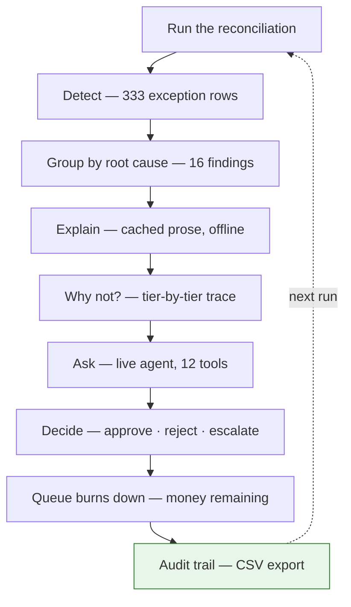

The loop closes. Decisions persist, the queue burns down, and the audit trail
exports as CSV — the artifact a controller hands an auditor.

---

## "Why not?" — the decline trace

Every tier records a reason for every entity it declines. On seed 42, **251
entities carry a different reason in a later tier than they did in Tier 1**, so
the *sequence* is the story:

> **Tier 1 · Exact reference match** — `NO_BANK_CREDIT_WITH_UTR`
> No bank credit anywhere in the statement carries this payout's UTR.
>
> **Tier 2 · Tolerant match** — `NO_TOLERANT_CANDIDATE`
> Even with the band relaxed and the window widened, no bank credit fits this
> payout's net of ₹2,02,784.47.
>
> **Tier 3 · Settlement arithmetic** — `MISSING_IN_BANK`
> The payout reproduces exactly from the settlement equation, and no credit for
> it appears in the statement at all.

---

## The Q&A agent

A live model with **12 tools** that query a completed reconciliation run. It is
never given the ledgers — there is no dataset in its context to misread, and it
cannot compute a total because it never sees the rows.

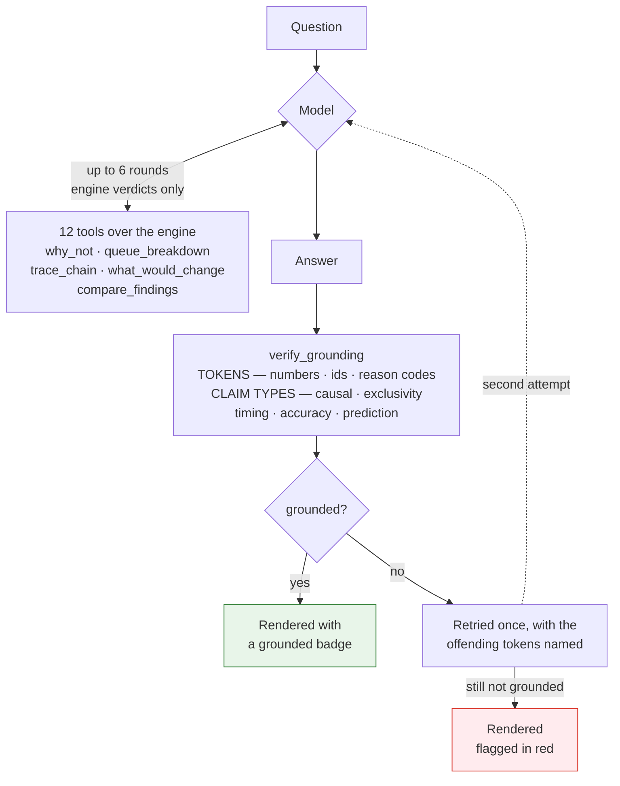

**The model decides what to look up and how to say it. The engine decides what
is true.** Every figure it reports came out of a tier, and the tool calls are
shown in the UI so you can watch it query the engine rather than take its word.

---

## What broke, and how you got out

**The model got every number right and invented the reasoning.**

`verify_numbers()` asserted every rupee figure and entity ID in generated prose
appeared in the source record. It caught fabricated amounts and a malformed
settlement ID missing a digit from the year.

Then I read the responses that passed. On a `MISSING_IN_BANK` payout: *"the
gateway has already sent the money, so the gap is on the bank side."* Every
figure verified, the causal claim fabricated — release status is precisely the
unknown. **5 of 9 verified responses did this.** Numeric and causal hallucination
are different classes; the second is invisible to number-checking. My prompt
instructed against speculation. Asking is not enforcing.

**Fix:** separate hypothesis generation from testing. Tier 3 already establishes
cause deterministically — subset search, a named item, an empirical estimate of
accidental fit. The mechanism text is selected from that result and passed as
`mechanism_to_paraphrase`, a fact like any amount. **5/9 → 0/11.**

Then I tested it against unbounded input. Queue explanations are precomputed; the
Q&A agent is live, 12 model-selected tools, no cache. `verify_grounding()`
requires every figure, ID and code to trace to a tool result. Failed calls are
excluded from the vocabulary — echoing an ID in an error was making fabricated
IDs "grounded."

It fired on an unseen question: first attempt named `ORDER_UNPAID` with zero tool
calls, flagged, retried, declined. **The code was correct. Refused anyway** —
accepting lucky guesses means accepting the class they belong to.

Then the residual class: *"do failures cluster at month end?"* answered with
money shares from `queue_breakdown`, which has no date dimension. Every figure
real, so verification passed correctly. `verify_grounding` already did claim-type
checking for causal and uniqueness claims — timing and accuracy got through
because they weren't in the table. So `TOOL_CAPABILITIES` declares what each tool
supports, and the load-bearing part is what nothing declares:
`temporal_distribution`, `accuracy_rates`, `prediction`.

**Controls first:** rules-free build gave 0 false positives, 7 misses, suite red.
With rules, green. Rules disabled at runtime, 0 of 3 caught — proving a green
suite can't come from an inert check.

**I built an LLM adjudicator and cut it.** 20 probes, 6 controls: agent
self-declined 18/20, table caught 2/20, adjudicator caught 0 incremental, 1.67s
added. The prompt does most of the work; the table is the deterministic backstop,
which matters because prompt compliance is probabilistic and a table isn't.

**Stated limit:** this checks claim *type* against declared capability. It cannot
verify a supported claim is correctly reasoned.

**What I'd do differently:** I tested output was correct before testing it was
grounded, and both before testing whether the evidence could bear the claim's
shape. Three properties, three instruments.

---

## Why ground truth is the whole point

A production reconciler can report **coverage** — how much it matched. It cannot
report **precision**, because it has no oracle; establishing whether a match was
*correct* requires a human to audit it.

Because this data is generated, the oracle exists. `ground_truth.json` records
that `ord_000044 → pay_000001 → setl_20260706_002 → bank_000002` is the true
chain, so a false-positive rate is directly measurable.

That matters because the two error modes are wildly asymmetric. A **miss** goes
to the exception queue and costs a human two minutes. A **wrong match** is
silent, plausible, and lands in the books — surfacing months later as an
unexplained variance, or not at all.

So the synthetic data is not a limitation to apologise for. **It is the only
reason the dangerous error mode is measurable at all.**

### The firewall

`ground_truth.json` is readable **only** from `eval/`. The matcher never opens
it, and `service/` never imports `eval/`. `tests/test_firewall.py` asks the
interpreter what actually got imported — with a positive control that imports
`eval.score` to prove the detector isn't blind — and replays five path-traversal
spellings against the HTTP layer, because `GET /../../data/seed42/ground_truth.json`
once returned 200 with the answer key.

---

## Evidence

The Evidence page is the answer to *"you only tested on one dataset."*

- **Cross-seed consistency** — 30 unseen seeds, ranges not best-case
- **Tolerance sweep** — 34 settings from 2 paise to ₹1,000, interactive.
  Precision is exactly 1.0 from 2 paise through ₹100 on all four seeds; the
  first loss is at ₹140. On every seed, *the first tolerance that changes
  coverage is the same tolerance that breaks precision* — the engine buys
  coverage only by guessing, so it does not buy it.
- **Subset reliability** — where membership inference stops being trustworthy.
  Pool ceiling 20, derived from measurement and cited by number in
  `tier3_attribution.py`.
- **Evidence calibration** — accuracy per band, and the honest 30-seed figure.

One finding worth surfacing: the closed-form estimate of accidental fits,
`E = N·W/R`, was **35× optimistic at L4** — it predicted 0.069 where counting
against the real pool found 2.40. That moved L4 from CIRCUMSTANTIAL to REFUSE,
and 9 of 13 L4 attributions are refused because of it. The estimate is measured
against the actual amount distribution, not assumed uniform.

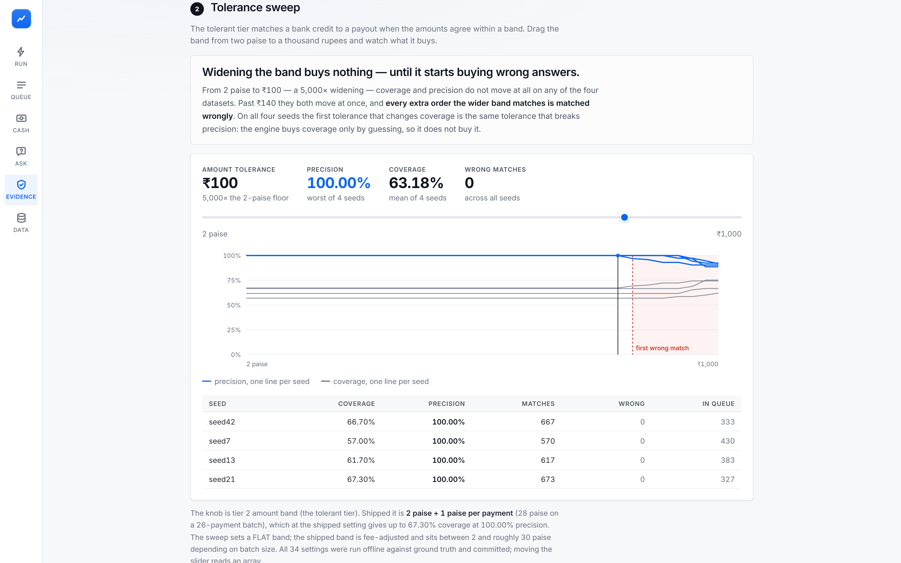
*Drag the amount tolerance across four orders of magnitude. Precision (blue)
holds at 100% until the shaded region, where it breaks at the same instant
coverage first moves.*

---

## Design commitments

**Integer paise, everywhere.** No float touches a money value. `0.1 + 0.2 != 0.3`,
and an engine that accumulates representation error invents variances it then has
to explain. CSVs are read with `dtype=str` — letting pandas infer `float64`
reintroduces exactly the bug the rest of the codebase avoids.

**Fully seeded and byte-reproducible.** Same seed plus same config yields
identical output on any machine. Percentages are applied in basis points via
integer arithmetic rather than float multiplication, so generation cannot drift
across platforms.

**A defect is not an exception.** A truncated narration is still a resolvable
match — the money is real, only the machine-readable handle is gone. Only
genuinely unresolvable items carry an exception code. That separation is what
makes exception accuracy measurable rather than tautological.

**Every defect names its mechanism.** `config/defects.yaml` carries a `mechanism`
string per defect. It is documentation, never executed. It exists because
`missing_reference_id: 0.06` invites the correct objection — *payment IDs exist,
that is the entire point of them* — so each entry names the concrete process that
destroys the linkage: narration clipped at 35 chars, direct NEFT with no payment
object, retry-on-perceived-failure.

**Exceptions group by root cause, not by row.** One payout going wrong strands
dozens of orders. An operator works the cause once, not each row — which is why
333 rows become 16 findings.

---

## Verifying the data

`eval/validate.py` runs **125 checks per dataset**. It does not import the
generator: it reads only the emitted CSVs, `ground_truth.json` and the YAML
configs, and recomputes every derived quantity from first principles. A validator
sharing code with the thing it validates cannot catch a bug in the shared code —
it reproduces the same error on both sides and reports agreement.

| Section | Checks | | Section | Checks |
|---|---|---|---|---|
| 0. Primitive self-tests | 12 | | 6. Settlement equation | 11 |
| 1. File presence & schema | 19 | | 7. Settlement timing | 7 |
| 2. Identifier uniqueness | 6 | | 8. Bank statement | 3 |
| 3. Referential integrity | 8 | | 9. Ground truth consistency | 25 |
| 4. Money representation | 20 | | 10. Defect rates vs config | 6 |
| 5. Fee arithmetic | 4 | | 11. Difficulty band | 4 |

Two checks are phrased as **domain invariants** rather than as restatements of
the formula, and those are the ones that caught a carry-forward sign error: a
cycle that carries forward must pay out exactly zero, and no cycle may ever
settle above its own gross. A check that restates the equation agrees with a
generator that got the equation wrong.

---

## Seed discipline

| Seed | Role | Rule |
|---|---|---|
| 42 | Development | Debug freely, run a thousand times |
| 7, 13, 21 | Validation | Run periodically to catch overfitting — burned by design |
| 200–229 | Breadth sweep | 30 unseen datasets, the headline accuracy claim |
| **99** | **Held out** | Generated day one, sealed, **run once** at freeze. Never re-run. |

If you run seed 99, see a disappointing number, and fix the failures, seed 99 is
now a development set and its score means nothing. Its entire value comes from
not having been looked at.

---

## Where the language model sits, and why

**Two places, with different rules.**

**Queue explanations — offline and cached.** The model writes prose and nothing
else: every amount, date and identifier is computed by the tiers and passed in.
Explanations are cached per seed and committed, so the running service makes
**zero API calls** for them and works identically with `MISTRAL_API_KEY` unset.

**The Q&A agent — live, and the deliberate exception.** It makes real calls at
request time. It is given tools rather than data, and every answer passes
`verify_grounding` before it is rendered.

The reason for the split is arithmetic, not caution. 667 matches at 100%
precision come from a settlement equation that either reproduces to the paisa or
does not; nothing about them needs a human to check. Put a model anywhere in that
path and all 667 need checking again, because a model that is right 99% of the
time has introduced a 1% error rate into the one process whose entire value is
being exactly right. **Reconciliation is a determinism problem. The model belongs
at the edges, describing decisions it did not make** — or asking the engine
questions and being checked when it answers.

---

## Threats to validity

Deliberately not modelled, and why the exclusions are choices rather than blind
spots:

- **Multi-currency / FX settlement** — capture and settlement amounts legitimately differ by a rate you don't hold
- **Partial settlements split across payouts** — one batch → two bank lines breaks Tier 3's shape
- **Rolling reserves** — a % withheld now and released 90–180 days later pulls terms in from outside the window
- **International card scheme quirks** — per-scheme cross-border fees and dispute timelines
- **State-varying bank holidays** — `config/rates.yaml` carries a national list only
- **Fraud** — this generator injects *accidental* messiness; fraud is *intentional* and has a different statistical shape

Carry-forward fires only when a cycle's refunds exceed its gross — roughly 1 seed
in 4 at these rates. Seeds 42 and 99 contain none, so that branch is exercised by
the multi-seed sweep rather than by the two headline datasets.

`settlement_missing_in_bank` is a **settlement-level** defect, so one missing
payout removes every order in that batch at once. Its impact is lumpy across
seeds (0–42 chains in testing) — realistic, since a missing payout genuinely is a
large event, but that metric bounces between seeds more than the others.

All fee, tax and withholding rates in `config/rates.yaml` are **illustrative
parameters**, not sourced pricing. This project makes no compliance claim.

---

## Repository layout

```
finrecon/      the engine — one tier per module, no monolithic main
  normalize.py       Tier 0 · six schemas into one shape
  tier1_exact.py     Tier 1 · exact reference joins
  tier2_tolerant.py  Tier 2 · relaxed evidence, refuses ambiguity
  tier3_settlement.py  Tier 3 · the settlement equation, run backwards
  tier3_attribution.py Tier 3b · name the cause, or refuse
  tier5_exceptions.py  Tier 5 · group by root cause
  evidence.py        how much a coincidence is worth
  explain.py         prose only, cached, verified

service/       read-only HTTP over the engine + the built frontend
  qa.py              the agent: 12 tools, verify_grounding, claim rules
  trace.py           "why not?" — the decline ledger, rendered
  cash.py            the cash position (a view, not a rule)

eval/          the only side of the wall that may read ground truth
tests/         invariants, firewall, agent guardrails, agent answers
web/           React frontend; dist/ is committed
INCIDENTS.md   every failure, what was checked, what changed
FAILURES.md    the patterns behind them
```

`INCIDENTS.md` is worth reading if you want to know how much of this was wrong
before it was right. The recurring theme is that **the measuring instrument was
the broken thing ten times** — which is why every check in this project now ships
with a control that fails when the check is inert.
